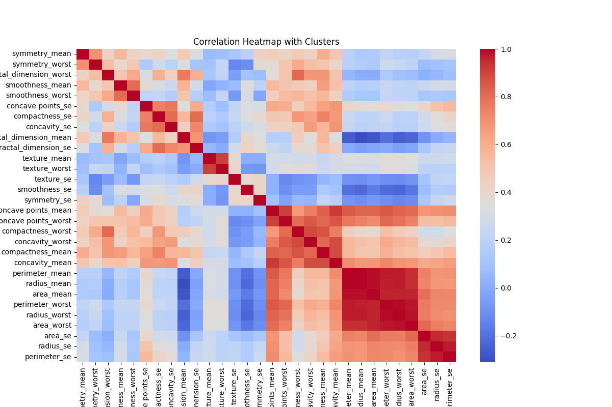
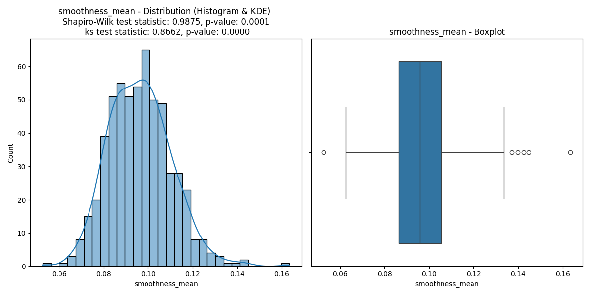
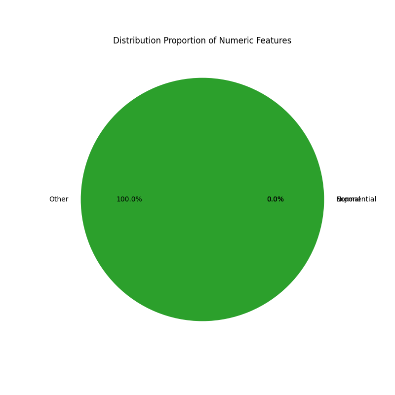
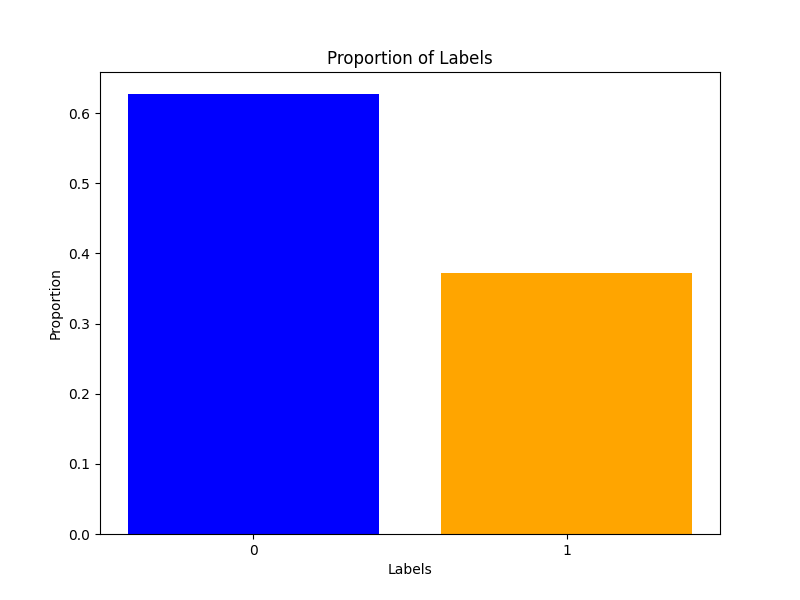
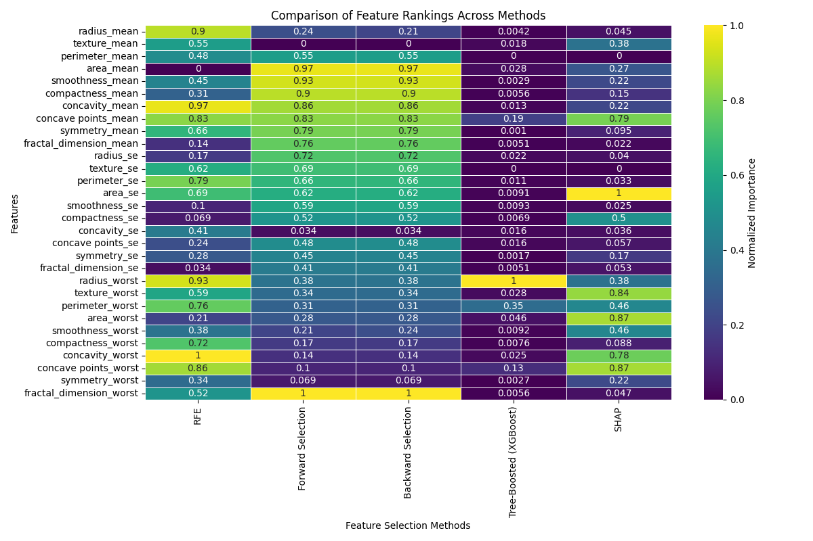
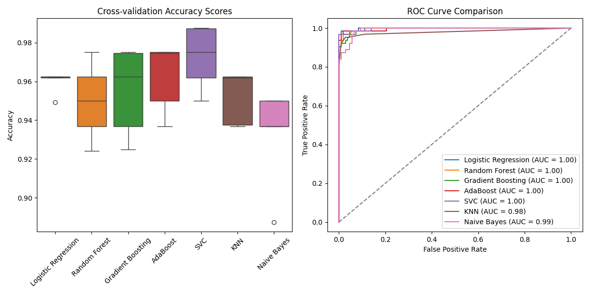
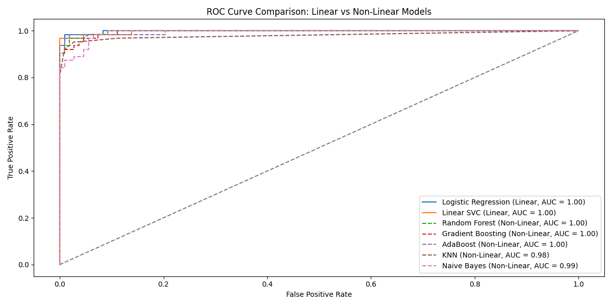
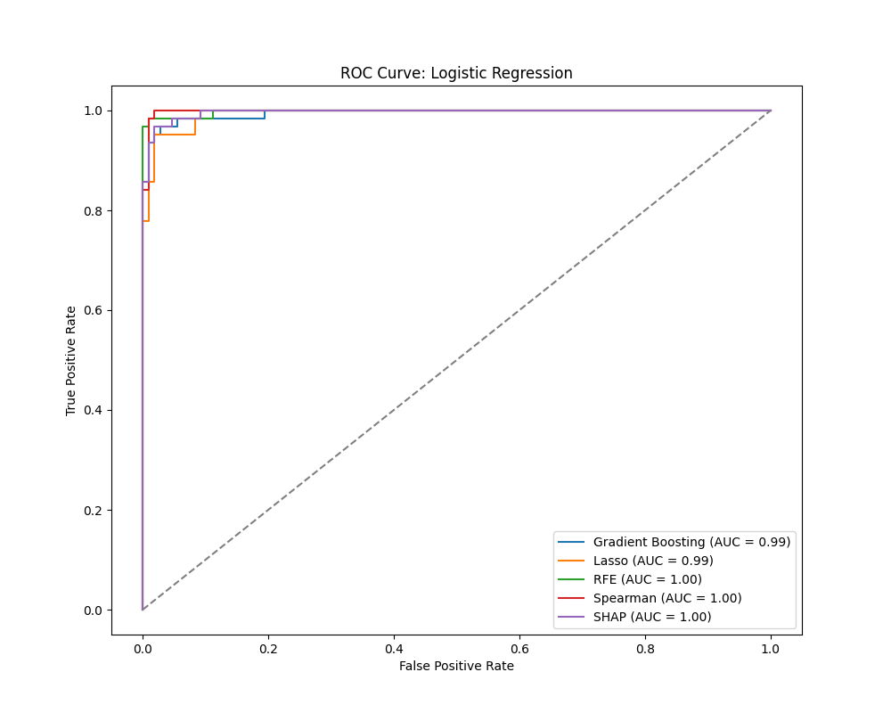

# Machine Learning Workflow Guide

This guide provides a structured approach to building, analyzing, and evaluating machine learning models using a breast cancer dataset. The workflow consists of six key steps: handling missing values, exploratory data analysis (EDA), standardization, feature selection, class balancing, and model building. Each step is modularized with functions provided in custom Python modules.


### Table of Contents

    - Getting Started
    - Modules Overview
    - Workflow Steps
        -> Step 1: Handle Missing Values
        -> Step 2: Exploratory Data Analysis (EDA)
        -> Step 3: Standardization
        -> Step 4: Feature Selection
        -> Step 5: Handle Class Imbalance
        -> Step 6: Build Machine Learning Models
    - Feature Selection Methods
    - Model Evaluation

### Getting Started

#### Prerequisites

    Python 3.x
    Required libraries: numpy, pandas, matplotlib, seaborn, scikit-learn, and others specified in requirements.txt.

#### Installation

Clone the repository and install dependencies:


```
    git clone https://github.com/your-repo/ml-workflow.git
    cd ml-workflow
    pip install -r requirements.txt

```

#### Dataset

Ensure the dataset is located in the data directory. By default, the code uses breast_cancer.csv.


#### Modules Overview

    - missing_values_imputation: Handles missing values and column deletion.
    - exploratory_data_analysis: Conducts data exploration with visualizations and statistical insights.
    - standardization: Provides normalization and standardization methods.
    - feature_selection: Implements various feature selection techniques.
    - balancing_classes: Addresses class imbalance issues.
    - build_models: Builds and compares machine learning models.

## Workflow Steps

## Step 1: Handle Missing Values

Perform basic imputation or more advanced (machine learning models) for missing data:

```
    X, y = impute.do_basic_imputation(file_dir, col_num=1)

```

Remove obsolete columns manually:


```
    X = impute.delete_column(X, col_name='id')

```

## Step 2: Exploratory Data Analysis (EDA)

Gain insights into the dataset:

Data types:


```
    eda.unique_data_types(X)

```

Correlation and clustering:


```
    eda.clusters_heatmap(X)

```




Distribution analysis:

The Shapiro Wilk test was used to test for normality and the Kolmogorov Smirnov test was used to test if the distribution is exponential the graph helps to vizualize if most feature are normally distributed or exponentially distributed , for this dataset no particular distribution was detected with significance however visually, using :

```
    eda.distribution_analysis(X)

```




I could see that a lot of features seemed to follow a normal or an exponential distribution, Shapiro Wilk is sensitive to large datasets and even small deviations can result in rejection of null hypothesis , the Kolmogorov Smirnov test assumes that the data tested spans the entire range of the theoritical exponential distribution and so doing a visual check with previous function can help when no distribution is detected by the tests.

```
    eda.distribution_analysis_of_repartition(X)

```





Label distribution:


```
    eda.plot_label_distribution(y)

```




## Step 3: Standardization

Normalize or standardize features for machine learning:


```
    X_normalized = std.normalize_data(X)
    X_scaled = std.standardize_data(X)

```

## Step 4: Feature Selection

Evaluate and select important features using various methods depending of feature data type:

   
```
    feature_rank_dict_universal = fs.compare_methods_universal(X, y)
    feature_rank_dict_numerical = fs.compare_methods_numerical(X, y)

```

Visualize feature importance:


```
    fs.plot_feature_importance_comparison(feature_rank_dict_universal, feature_names)

```



Select features using specific methods:


```
    X_gradient_boosting, feat_imp = fs.gradient_boosting_selection(X, y)

```

## Step 5: Handle Class Imbalance

Use resampling methods or alorithm level methods to avoid bias because of class imbalance in your models :


```
    X_resampled, y_resampled = balance.smote_sampling(X, y)

    model_LG = balance.logistic_regression_balanced(X_resampled, y_resampled)

```

## Step 6: Build Machine Learning Models

Train and evaluate models:

    Compare models:


```
   build.compare_models(X, y)

```


Use selected features for model comparison:


```
    build.compare_models_with_feature_selection(datasets_dict)

```


## Feature Selection Methods

The following methods are implemented for feature selection:

    Gradient Boosting
    Lasso Regression
    Recursive Feature Elimination (RFE)
    Spearman Correlation
    SHAP (SHapley Additive exPlanations)

Example:

```
    X_rfe, ranks = fs.rfe_selection(X, y, n_features_to_select=15)

```

## Model Evaluation

Compare models performance depending on models used, feature selection used, normalization of data, if the models are linear or not...


```
    build.compare_linear_vs_nonlinear_models(X, y)
    build.compare_models(X_normalized,y)
    build.compare_models_with_feature_selection(datasets_dict)

```






